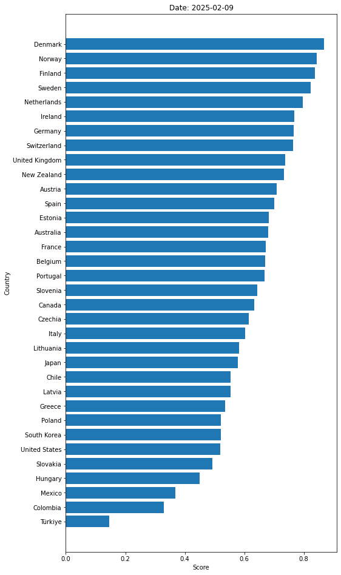

# OECD Rankings


This project aims to provide a straightforward analysis of OECD member countries based on various international rankings. By normalizing and comparing data from different sources, the project helps identify areas where countries perform well and areas that need improvement. The results can be used by policymakers, researchers, and the general public to gain insights into the performance of OECD countries across different metrics.

For more information about the OECD, please visit the [Organisation for Economic Co-operation and Development (OECD) website](https://www.oecd.org/).

## Table of Contents

- [Data Sources](#data-sources)
  - [Climate Change Performance Index (CCPI)](#climate-change-performance-index-ccpi)
  - [Corruption Perceptions Index](#corruption-perceptions-index)
  - [Environmental Performance Index](#environmental-performance-index)
  - [Equality Index](#equality-index)
  - [Global Gender Gap Report](#global-gender-gap-report)
  - [Global Organized Crime Index](#global-organized-crime-index)
  - [Global Peace Index](#global-peace-index)
  - [Global Terrorism Index](#global-terrorism-index)
  - [Happy Planet Index](#happy-planet-index)
  - [Human Development Index (HDI)](#human-development-index-hdi)
  - [Legatum Prosperity Index](#legatum-prosperity-index)
  - [Social Progress Index (SPI)](#social-progress-index-spi)
  - [The Economist Democracy Index](#the-economist-democracy-index)
  - [World Happiness Report](#world-happiness-report)
  - [Data Coverage](#data-coverage)
- [Data Calculation](#data-calculation)
- [Usage](#usage)
- [License](#license)

## Results



**NOTE:** The bar chart may not include every OECD member state if they are not present in all datasets.

## Data Sources

The data used in this project is sourced from the following reports:

### Climate Change Performance Index (CCPI)

The Climate Change Performance Index (CCPI), published annually since 2005, is an independent monitoring tool for tracking countries’ climate mitigation performance. It increases transparency in national and international climate policy and enables comparison of individual countries’ climate action efforts and progress. For more information, visit the [Climate Change Performance Index (CCPI) page](https://ccpi.org/).

### Corruption Perceptions Index

The Corruption Perceptions Index ranks countries based on perceived levels of public sector corruption. For more information, visit the [Transparency International CPI page](https://www.transparency.org/en/cpi).

### Environmental Performance Index

The Environmental Performance Index ranks countries based on environmental health and ecosystem vitality, considering factors like air quality, water resources, and biodiversity. For more information, visit the [Environmental Performance Index page](https://epi.yale.edu/).

### Equality Index

The Equality Index measures the current status of LGBT rights, laws, and freedoms as well as public attitudes towards LGBT people. For more information, visit the [Equality Index page](https://www.equaldex.com/equality-index).

### Global Gender Gap Report

The Global Gender Gap Report measures gender-based disparities in areas like economic participation, education, health, and political empowerment. It provides insights into progress toward gender parity across different countries. For more information, visit the [World Economic Forum Global Gender Gap Report page](https://www.weforum.org/publications/global-gender-gap-report-2024/digest/).

### Global Organized Crime Index

The Global Organized Crime Index ranks countries based on their vulnerability to organized crime, considering factors like corruption, criminal justice, and law enforcement. For more information, visit the [Global Initiative Against Transnational Organized Crime page](https://globalinitiative.net/).

### Global Peace Index

The Global Peace Index ranks countries based on peace and stability, considering factors like conflicts, militarization, and societal safety. For more information, visit the [IEP Global Peace Index page](http://visionofhumanity.org/indexes/global-peace-index/).

### Global Terrorism Index

The Global Terrorism Index ranks countries based on the impact of terrorism and the extent of terrorist activities. It considers factors like the number of terrorist incidents, fatalities, injuries, and property damage. For more information, visit the [Global Terrorism Index page](https://www.visionofhumanity.org/global-terrorism-index/).

### Happy Planet Index

The Happy Planet Index measures what matters: sustainable wellbeing for all. It tells us how well nations are doing at achieving long, happy, and sustainable lives. For more information, visit the [Happy Planet Index page](https://happyplanetindex.org/).

### Human Development Index (HDI)

The HDI ranks countries based on life expectancy, education, and per capita income. It provides a measure of well-being and development beyond economic performance. For more information, visit the [UNDP HDI page](http://hdr.undp.org/en/content/human-development-index-hdi).

### Legatum Prosperity Index

The Legatum Prosperity Index ranks countries based on prosperity and well-being, considering factors like economic quality, business environment, governance, and personal freedom. For more information, visit the [Legatum Prosperity Index page](https://www.prosperity.com/).

### Social Progress Index (SPI)

The SPI ranks countries based on social and environmental performance, considering factors like basic human needs, foundations of well-being, and opportunity. For more information, visit the [Social Progress Index website](https://www.socialprogress.org/).

### The Economist Democracy Index

The Economist Democracy Index ranks countries based on their democratic status, considering factors like electoral process and pluralism, civil liberties, and political culture. For more information, visit the [Economist Intelligence Unit Democracy Index page](https://www.eiu.com/n/campaigns/democracy-index-2023/).

### World Happiness Report

This report ranks countries based on citizens' well-being and happiness, considering factors like GDP per capita, social support, and life expectancy. For more information, visit the [World Happiness Report website](https://worldhappiness.report/).

### Data Coverage

The datasets used in this project cover the following years:

| Dataset                                 | Year |
| --------------------------------------- | ---- |
| Climate Change Performance Index (CCPI) | 2025 |
| Corruption Perceptions Index            | 2023 |
| Environmental Performance Index         | 2024 |
| Equality Index                          | 2025 |
| Global Gender Gap Report                | 2024 |
| Global Organized Crime Index            | 2023 |
| Global Peace Index                      | 2024 |
| Global Terrorism Index                  | 2024 |
| Happy Planet Index                      | 2021 |
| Human Development Index (HDI)           | 2022 |
| Legatum Prosperity Index                | 2023 |
| Social Progress Index (SPI)             | 2023 |
| The Economist Democracy Index           | 2023 |
| World Happiness Report                  | 2024 |

## Data Calculation

During the calculation process, the scores in the `data.csv` file will be normalized to values between 0 and 1. This normalization allows for a standardized comparison across different datasets. The normalization is done using the following formula:

```python
normalized_score = (score - worst_score) / (best_score - worst_score)
```

This process ensures that all scores are on a common scale, making it easier to compare different countries across various metrics such as human development, safety, happiness, etc. By using normalized scores, the project can provide a more accurate and fair comparison of how each OECD member country excels in different areas.

The normalized scores will be used to find the average score for each of the 38 OECD member countries. The countries will then be ranked based on their average scores to provide an overall comparison of their performance across the different metrics.

## Usage

Process the `data.csv` file, generate results for OECD member countries, and export the results in CSV and JSON format, along with a visual bar chart:

```sh
python3 main.py
```

Running the command will produce a `results.csv`, `results.json`, and `assets/results.png` file containing the results for all OECD countries.

**NOTE:** The generated files may not include every OECD member state if they are not present in all datasets.

## License

This project is licensed under the MIT License. See the `LICENSE` file for details.
